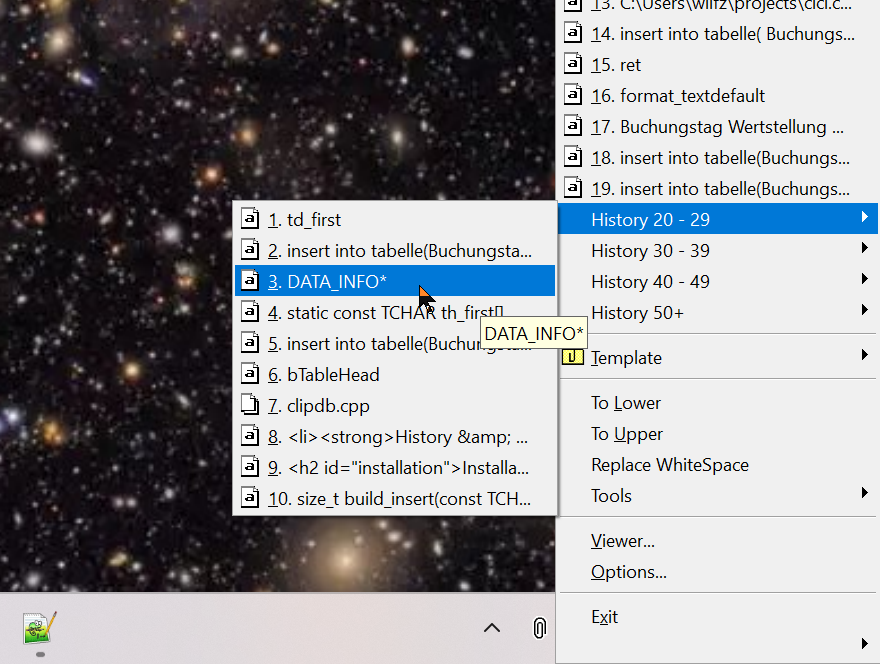
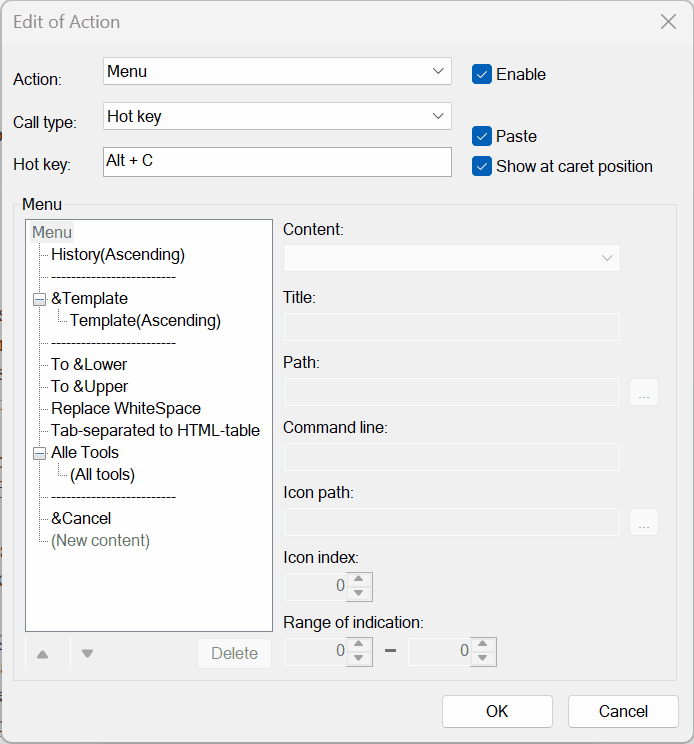
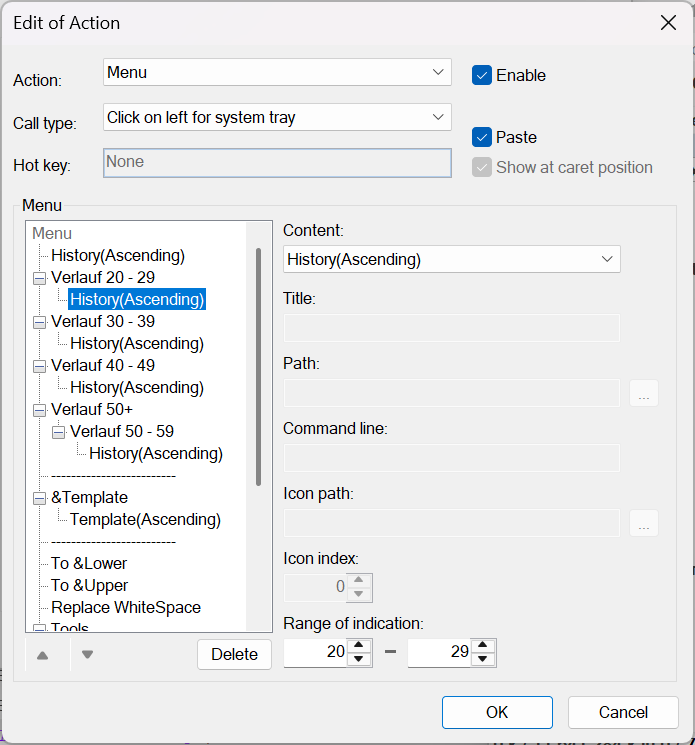

# CLCL - Clipboard Manager

**Version:** 2.1.6

## Overview
CLCL is a powerful Windows clipboard manager with plugin support and customizable hotkeys.

It provides quick access to recent clipboard items via a customizable pop-up menu and supports extended clipboard formats including text, images, and files.

## Features
- **Universal Format Support** - Handles all clipboard formats automatically
- **Template Registration** - Save frequently used templates for quick access
- **Hotkey Menu Display** - Quick access pop-up menu via Alt+C (customizable)
- **Custom Menu Support** - Fully customizable menu organization and appearance
- **Image Previews** - Thumbnail display of bitmap content in menu
- **Tooltip Hints** - Hover tooltips for clipboard items and tools
- **Format Control** - Selective saving of specific clipboard formats
- **Window Filtering** - Ignore clipboard changes from specific applications
- **Custom Paste Keys** - Per-window paste key configuration
- **Plugin Architecture** - Extensible functionality via DLL plugins
- **History Size** - The maximum number of items in the history can be configured
- **Unicode Support** - Full Unicode support for international text
- **Multiple Language** - User interface language can be switched between English, Japanese, German, Simplified Chinese, and Ukrainian
- **Binary Viewer** - View raw binary clipboard data in hex format
- **History & Registry** - Persistent and automatically saving clipboard history and templates
- **Free and Open Source** - Under active development on [github.com/wilfz/CLCL](https://github.com/wilfz/CLCL)

## Installation
Works on current Windows OS.

Download and launch [setup_clcl_2_1_6_beta2.exe](https://github.com/wilfz/CLCL/releases/download/v2.1.6_beta2/setup_clcl_2_1_6_beta2.exe).
The setup may issue a warning when started. This does not imply a threat, but is due to the fact that as a private developer I cannot afford to purchase a certificate to sign the binary for an Open Source project.

If you want to uninstall, do so from the Control Panel __after__ closing CLCL.

Instead of the automatic installer, you can also download [CLCL_2_1_6_beta2.zip](https://github.com/wilfz/CLCL/releases/download/v2.1.6_beta2/CLCL_2_1_6_beta2.zip), unpack it into a folder of your choice, and start `clcl.exe` from there.

### Data Storage
By default, data and settings are stored in this folder (for Windows 10/11):

	C:\Users\{username}\AppData\Local\CLCL

### Portable Mode
To store data and settings in the same location as `CLCL.exe`, set `clcl_app.ini` as follows and then start CLCL.
```ini
[GENERAL]
portable=1
```


### Language Settings
The menus and dialogs are in English, Japanese, German, Simplified Chinese, or Ukrainian, according to your Windows language preferences.
You can override this by explicitly setting the language on the Viewer tab in Options.  
The selected language is stored in the `[main]` section of `CLCL.ini`.
```ini
[main]
...
language="en"
```

## Usage

### Basic Operation

**Startup:**
When you start `CLCL.exe`, a clip icon appears in the task tray (the area with the clock in the corner of the taskbar).

**Display Menu:**
- Left-click the clipboard icon in the taskbar to open the menu  
  or
- Press Alt+C (default hotkey) to show the menu
- Select an item to paste it to the active window
- Right-click menu items for additional options

By default, the menu displays the [history](#history) in descending order (newest first).
The menu can be customized in the settings.

**Viewer Window:**
- Right-click the taskbar icon to open the Viewer
- Left Panel of the viewer: Shows history and templates in a tree view
	- Browse clipboard history and templates
	- Double-click to copy an item to the clipboard
	- The "Clipboard" at the top of the tree is the current clipboard content.
	- The ["History"](#history) in the tree is a list of recent clipboard entries.
	- ["Templates"](#templates) in the tree is a list of template items (such as standard phrases).
- Right Panel: Show and edit content of the selected item; if a tree node is selected, all sub-items are shown as a list with (the beginning of) their data, modification time, and whether and which hotkey is attached to the respective sub-items.

**Tree Structure:**

	┌─■ Clipboard - Current clipboard contents
	│ ├─□ TEXT - Formats in the current clipboard
	│ ├─□ LOCALE
	│ └─□ OEM TEXT
	│
	├─■ History - Clipboard history
	│ ├─□ (BITMAP) - History items
	│ │ ├─□ BITMAP - Formats in history items
	│ │ └─□ DIB
	│ │
	│ ├─□ Hello...
	│ │ └─□ TEXT
	│ │
	│ ├─□ Today...
	│ └─□ (BITMAP)
	│
	└─■ Templates - Template items
	  │
	  ├─■ Folder - Folder
	  │ ├─□ Address...
	  │ └─□ (BITMAP)
	  │
	  └─□ http://www... - Template item
		└─□ TEXT - Format in template item

### Menu
If you move the mouse over a history or template item in the menu, a tooltip with detailed information will be displayed at the mouse position. If you select an item with the keyboard, a tooltip will be displayed under the menu item.

Right-clicking on a [history](#history) or [template](#templates) item will display the registered tools in a menu, and the selected tool will be executed and sent to the clipboard.

To display the tool menu with the keyboard, press Ctrl and Enter and then select a tool.

The menu items displayed in the task tray or with hotkey are configured in the ["Action"](#action) option.
You can customize the menu behavior and how items are shown on the ["Menu"](#menu-settings) tab of the options.

### History
Newly copied data is added at the top of the history.

A single history item contains multiple clipboard formats. 
Use the ["Format"](#format) option in Options to register preferred formats and control priority when displaying items.  
The clipboard format with the highest priority is displayed in the menu and viewer.

The number of history items to keep is set in the ["History"](#history-settings) tab of CLCL Options.

The ["Filter"](#filter) option in Settings determines which formats are added to the history.

### Templates
Save frequently used data such as standard phrases, text snippets, URLs as templates.
You can add folders to organize them into hierarchical structures and give names to items.

**To Add an Item:**
1. In Viewer, select the clipboard or a history item
2. Right-click to get the context menu and choose "Add to Templates"
3. Optionally choose a subfolder where to store the item.

**To Add a Folder:**
1. Right-click in Viewer on Template or a subfolder thereof
2. Choose "New folder" from the context menu

**To Rename Items/Folders:**
1. Open Viewer
2. Select the item
3. Right-click and choose "Rename"

**To assign a Hotkey for an Item:**
1. In Viewer right-click on a template item
2. Choose "Set Hotkey ..." from the context menu

**Clear Name** erases the previous name and displays the item's contents as the name.
If you name an item "-", it will be displayed as a separator in the menu. The format and data in the item will be ignored.

If you add **&** to the name, the character following it will be used as the shortcut key in the menu. If you want to display & itself in the menu, use &&.

Right-click on a template item to display the menu and select "Hotkey Settings" to assign a hotkey to the template item. Pressing that key sends the template item directly to the clipboard without displaying the menu, and pastes it directly if "Paste" is enabled.
You can see the registered hotkeys in the list view of the viewer. If you select other template items, they will be displayed in the status bar.

There is no limit to the number of template items or the clipboard format.

### Send to Clipboard
There are several ways to send history or template items to the clipboard.

- Click the task tray to bring up a menu.
If you select a history or template item from the menu, the data will be sent to the clipboard and automatically pasted into the active window.

- Press the hotkey (default is Alt + C) to bring up a menu.
If you select a history or template item from the menu, the data will be sent to the clipboard and automatically pasted into the active window.

- Select an item in the viewer and bring up a right-click menu.
If you select "Send to Clipboard", the selected item will be sent to the clipboard.

## Clipboard

### What is the clipboard?
The clipboard is an area where different applications can exchange data.
For example, when you copy text in Notepad and paste it in Word, both applications use the clipboard.

### Clipboard formats:
The clipboard can hold multiple formats simultaneously.
For example, if you copy text in Notepad, the following four formats will be stored in the clipboard (Windows 10/11):

	・UNICODE TEXT
	・LOCALE
	・TEXT
	・OEM TEXT

If you copy in Excel or Access, even more formats will be sent to the clipboard.

By default, CLCL is configured to preserve:
- UNICODE TEXT (text)
- BITMAP (images)
- DROP FILE LIST (files)

Use the ["Filter"](#filter) option in Settings to customize which formats are to be saved.

While the Viewer displays text data and many image formats automatically, other formats are shown as binary data in hexdump format.

For some formats, there is a format plugin to show the clipboard data in a more user-friendly way.  
CLCL comes with a RichTextFormat plugin which can be activated on the ["Format"](#format) tab of the Options.

## Tools (plug-ins)

Tools let you process current selection, history or template data before pasting, or extend CLCL's functionality. 

The installation package includes binaries of some useful plugins from https://nakka.com/soft/clcl/index_eng.html. These plugins have been reworked to fit current operating systems; especially the plugin DLLs are installed into the same folder as `clcl.exe`, the plugins' ini files to the same location as `clcl.ini`.

[**Configure tools in Options → Tool**](#tool-configuration)

### tool_text
Text manipulation tools:
- To Lower - Convert to lowercase
- To Upper - Convert to UPPERCASE
- Quotation - Mark as quotation e.g. with a leading '>' or an indention
- Un Quotation - Remove quotation from selected text
- Word Wrap - Wrap text at specified column width
- &lt;TAG&gt;&lt;/TAG&gt; - Wrap text with custom tags
- Delete CRLF - Remove line breaks
- Connection of text - Join clipboard history into one text
- Edit - Open text in an edit window

### tool_utl
Utility tools:
- Clear History - Delete all history items
- Clear Clipboard - Clear the clipboard
- Play Sound - Play a sound when items are added to history
- Always on Top - Keep viewer window on top
- Un Top - Remove always on top setting
- Save of more items - Save multiple selected items to files

### tool_clip
`tool_clip.dll` is an additional plugin from https://github.com/wilfz/CLCL-tool_clip. Currently it contains the following features for clipboard items:
- Replace tabstops and/or sequences of spaces by a character string of choice
- Replace with regular expressions
- Export items and template folders to JSON file
- Import text items and folders from JSON file and merge them into template folders
- Export to and import from the Android app [Clipper](https://play.google.com/store/apps/details?id=org.rojekti.clipper) / [Clipper+](https://play.google.com/store/apps/details?id=fi.rojekti.clipper)
- Convert tab-separated data into an HTML table snippet, ready to insert into an email, OneNote, etc.
- Macros, insert templates with expanded variables
- Send menu item to clipboard
- Show currently selected item in viewer
- Save CLCL templates to and load from an ODBC database 
- To be continued ...


## Options

Invoke the Options window either by right-clicking on the CLCL clip in the taskbar, or by calling it from the Viewer's main menu with View -> Options.  
In the various tabs of the Options window, you can customize CLCL according to your preferences and needs.

### History Settings

On the History tab of the options, you can set how many items to keep, when to save the history, how to handle duplicates, etc.

If you increase the number of history items to keep to a value bigger than the default of 30, it is recommended to organize the menus with submenus. See [here](#more-history-items-and-how-to-organize-the-popup-menu).

### Menu Settings

This tab controls **how** menu items are shown.  
CLCL contains several different menus.

History and template items are shown according to the "Display format of menu" option.  
The displayed numbers start from 0, but if you want to change the starting value, set the starting number between the % and the character.

Examples:

	%0d -> 0,1,2,3...
	%8x -> 8,9,a,b...
	%1n -> 1,2,3...8,9,0,1,2...
	%10B -> K,L,M,N...


To **add** a menu or configure the **content** of a specific menu, go to the ["Action"](#action) option.

### Viewer Settings

The Viewer is the main window of CLCL. On the Viewer tab, you can determine what to show in this window (Clipboard, History, Templates) and whether to show the above tree nodes collapsed or expanded.

With the language combo box, you select the language of the Viewer and the Options Window.

(If you happen to select a language unknown to you and cannot find the combo box to change it back to your language, you can undo this setting by deleting the language entry in the `[main]` section of `clcl.ini`.)

### Action
Actions and menus associated with a hotkey or a click on the task tray icon can be configured on the "Action" tab of the options.

"Call type" defines how to invoke the specified action.

When you specify "Hotkey", set the key to invoke.
"Ctrl + Ctrl", "Shift + Shift", and "Alt + Alt" invoke the specified action when you press the key twice.

If you specify Menu as the action, you can set "Paste".
When you select an item in the menu, the paste action is automatically sent to the application you are working in.
If you hold down Shift when selecting a menu item, it will not be pasted but will only be sent to the clipboard.

If you specify Menu as the action and Hotkey, Ctrl + Ctrl, Shift + Shift, or Alt + Alt as the invoking method, you can set "Show at caret position".
"Show at caret position" displays the menu at the caret position of the editor.
If you do not set it, the menu will be displayed at the mouse position.

If you specify Menu as the action and select History as the item, you can set the display range. The display range is specified from 1 to the number of items to be left in the history. Specifying 0 as the start number is the same as specifying 1, and specifying 0 as the end number is the same as specifying the number of items to be left in the history.

If the end number is smaller than the start number, nothing will be displayed. If the end number is larger than the number of items to be left in the history, only the number of items to be left in the history will be displayed.

### Format
CLCL can process all clipboard formats, but clipboard formats that are not registered will be displayed as binary dumps in the viewer.

Clipboard formats are registered in the options "Format". The registered format at the top takes priority, and the clipboard format with the highest priority among the items is displayed in the menu and viewer.

To register click on "Add", set the format name, the format-plugin DLL to be processed, and the function header. If you omit the DLL and press the function header selection button, a list of built-in function headers will be displayed.

For example, if you want to process the CSV clipboard format as text when copying in Excel, set it as follows:
```
Format name: CSV
DLL:
Function header: text_
```
The menu and viewer will process it as text.

Format-plugins are DLLs that enable CLCL to display specific content formats in a user-friendly way.

CLCL comes with the format-plugin *fmt_rtf.dll* for Rich Text Format.  
This can be activated by clicking on "Add", selecting the DLL and the rtf_ (Rich Text Format) function header.

### Filter
To select the clipboard format, set it in the "Filter" option.

If you select "Add all formats to history", all clipboard formats except those set to be excluded will be added to the history.

If you select "Exclude all formats from history", only clipboard formats set to be added will be added to the history.  

For clipboard formats set to be added in the filter, you can further set the size limit when adding to the history. Data exceeding the limit size will not be added to the history.

If you set the clipboard format in the filter to "Do not save", it will not be saved to disk when CLCL is closed.
For example, you can set it to add text and bitmaps to the history and save only the text.

### Window Settings
If you want to change the behavior of CLCL depending on the application you use, set the window and behavior in the "Window" option.

Specify the window title and class name, and use "*" as any character.  
For example, for Notepad, set it as follows:

	Title: * - Notepad
	Class name: Notepad

The behavior of CLCL will change when Notepad is active.  
Either the title or the class name needs to be entered, and if it is not entered, it is the same as specifying only "*".

- Don't add to history:
	Copying in the set window will not be added to the history.
	If you specify this option for an application that causes problems when added to the history, copying from that application will be ignored.

- Don't set focus: 
	Focus will not be set after activating the set window.
	If the focus goes somewhere when pasting the selected menu item and the pasting is not performed correctly, specifying this option may make it work correctly.

- Paste even if the tool is canceled: 
	When canceling a cancelable tool, the subsequent pasting is usually not performed, but if this option is specified, the pasting will be performed even if it is canceled.
	If you set the copy key as the cut key in the key settings for each window, specifying this option will prevent the characters from disappearing even if you cancel the tool.

### Key Settings for Each Window
Select the history or template item from the hotkey, and the paste action will automatically send the paste key to the window.  
By default, Ctrl + V is sent to all windows, but depending on the window, the paste key may be a different key.

When the tool is called with a hotkey, the copy key (Ctrl + C) is sent to the window to perform the Copy -> Tool Processing -> Paste action.

The copy and paste keys for each window are set in the "Key" option.
Set the title and class name of the window to be set and set the copy and paste keys.

If the copy and paste keys are not set, the default key settings will be used.

Multiple keys can be set for one window. If multiple keys are set, the keys will be sent in order from the top.

### Tool Configuration

When you select a tool DLL and function name, the tool name and call type are automatically set.

- The call type **Viewer** allows you to execute from the viewer's tool menu.
- The call type **Action Menu** allows you to execute from the "Tools" popup menu.
  - The **Send copy and paste** sub-option copies the marked data from the active window, executes the tool on the copied data, and afterwards pastes the modified data back into the active window.  
Without this option, the tool runs on the newest history item and copies it to the clipboard.  
Right-click on a menu item shows a popup menu with the installed tools and the selected tool runs on that item and sends the result to the clipboard.

Drag and drop a plug-in DLL into the tool list window to display a list of tools that can be registered, and you can select multiple tools to register them all at once.  


## Command Line
When starting CLCL, you can specify a command line to specify the operation after startup.

If CLCL is already running, the command will be sent to the already running CLCL.  
  
**Format:**

	CLCL.exe [/vownx]
		/v Display viewer
		/w Monitor clipboard
		/n Cancel monitoring clipboard
		/x Exit


## Helpful Hints

### More History Items and How to Organize the Popup Menu
On the *History* tab of the options, you can increase the maximum number of history items to keep, e.g., from 30 to 100. But without further configuration, the popup menu will look rather crowded.

It's a good idea to organize your history items in submenus:  



To do so, switch to the *Action* tab, choose the *Click on left system tray* menu or the *Alt-C* hotkey menu and click on Edit.  
A new window opens, and there you select *History/Ascending*. Most controls are greyed out, but you can specify the *Range of indication* for instance to 0 to 19.

  

OK. So now you have 100 items, but the menu would only show the first 19.  
In the left half of the *Edit of  Action* tab scroll down to the bottom and click on *(New Content)*.  
In the *Content* combo box choose "Pop-up Menu" and add "History 20 - 29" as *title*.  Now move the new pop-up menu upwards (with the little triangle below the left half of the window) until it is just below *History/Ascending*.  
Once again click on *(New Content)*. This time choose "History/Ascending" from the combo box and set the range to 20 to 29. Move the new *History/Ascending* entry upwards until it is just below your newly created pop-up menu and a little indented to the right.  
Continue so with as many pop-up menus as you like. You can even cascade the popups as shown in the screenshots.  




## Credits
- CLCL main program and plugins tool_text, tool_utl and tool_test are Copyright (C) by [Ohno Tomoaki](https://nakka.com/), who made it open source and put it under MIT license in 2024
- Special thanks: K.Takata
- Installer created by WilfZim with [Inno Setup](https://jrsoftware.org/isinfo.php)
- [Tool_clip plugin](https://github.com/wilfz/CLCL-tool_clip) by WilfZim depends on Niels Lohmann's JSON library ( https://github.com/nlohmann/json ) for import and export of data
- Translation to Simplified Chinese by HeliusHao


## Update History
- Ver 2.1.5 -> 2.1.6
	- Integration of CHM help (Issue [nakkag#26](https://github.com/nakkag/CLCL/issues/26)) and invocation of MS Help Viewer
	- Integration of Ohno Tomoaki's Rich Text Format plugin
	- Replace with regular expressions (tool_clip plugin)
	- Macros, insert templates with expanded variables (tool_clip plugin)

- Ver 2.1.4 -> 2.1.5
	- Added clipboard access delay setting (merge from Koichi-Kobayashi)
	- OS version check with recommended method (merge from Koichi-Kobayashi)
	- Display item title of unprintable characters as abbreviation or ASCII-Code (Issue [nakkag#23](https://github.com/nakkag/CLCL/issues/23))
	- Added context menu: Show (only current item) as binary
	- Added German user interface
	- Added Ukrainian user interface
	- Added Chinese user interface ([Issue #2](https://github.com/wilfz/CLCL/issues/2))
	- Switch user interface language in option's Viewer tab and save in CLCL.ini (works only if Windows version is Vista or newer)

- Ver 2.1.3 -> Ver 2.1.4
	- MIT license
	- Plugins updated to current OS
	- Merged Japanese and English Plugin Versions
	- Installer with optional plugins
	- English documentation
	- HTML Help in Viewer menu
	- Expand environment variables in tool paths

- Ver 2.1.2 -> Ver 2.1.3
	- Last release published under https://nakka.com/soft/clcl/index_eng.html
	- Changed the system tray icon when not monitoring the clipboard.
	- Improved the up and down movement buttons in the settings.
	- Improved so that the main screen does not appear when displaying the menu.

- Ver 2.1.1 -> Ver 2.1.2
	- Added the ability to scroll by dragging the mouse in image formats (BITMAP, DIB).

- Ver 2.1.0 -> Ver 2.1.1
	- Added a function to copy file names and file paths in file formats.
	- Added a setting to place settings and data in the same location as CLCL.exe.

- Ver 2.0.3 -> Ver 2.1.0
	- High DPI support.
	- Support for PNG and JPEG when saving image formats (BITMAP, DIB).
	- Enlarge or reduce image formats (BITMAP, DIB).
	  - Hold down Ctrl and use the mouse wheel, or Ctrl+↑↓ to change the magnification.
	- Binaries are no longer separated into Japanese and English versions.
	- Changed the settings save location to be saved in a separate area for each user.
	  -	For Windows 10/11, "C:\Users\(username)\AppData\Local\CLCL"
		(Automatically migrated on first launch)

- Ver 2.0.2 -> Ver 2.0.3
	- Fixed typos in the English version settings screen.

- Ver 2.0.1 -> Ver 2.0.2
	- Unicode support in settings files.
	  - Starting once with Ver 2.0.2 will make the settings file Unicode.
		The files before conversion are backed up with the file names "general.ini.back" and "clcl.ini.back".
		If you want to revert to an older version, use the above files.
	- The startup function has been changed from WinMain to wWinMain.

- Ver 2.0.0 -> Ver 2.0.1
	- Incorporated correction code from K. Takata
	  - Supports Unicode surrogate pairs
	  - Retry processing when task tray addition fails
	  - Prevents consecutive double startups and double startups from another user
	- Fixed a problem where the color of items disabled in the "Action" settings would sometimes become invisible
	- Improved the task tray icon when clipboard monitoring is stopped.

- Ver 1.1.2 -> Ver 2.0.0
	- Supports Unicode. As a result, older versions of Windows are no longer supported.
	  - The settings of the older version will be inherited, but tools and plugin formats must be Unicode-compatible.
	- Changed the behavior to copy the file if the save is successful so that template items are not deleted if the save process fails when CLCL is closed.
	- Changed the icon design in the task tray.
	- Changed the default behavior when clicking on the task tray.
	  - Changed the menu to appear when left-clicking the task tray icon to take into account operation on tablets.

- Ver 1.1.1 -> Ver 1.1.2
	- Fixed the problem where the tooltip background was not displayed correctly in a 256-color environment.
	- Optimized the menu display method.
	- Optimized the text display in the viewer.

- Ver 1.1.0 -> Ver 1.1.1
	- Improved the behavior when selecting the character position with the mouse in TEXT editing.
	- Fixed the error that occurred when there was no history to save with the filter when closing.
	- Made it possible to move items between history and template items.
	- Changed the method of displaying thumbnail images.
	- Changed the initial value of the waiting time for copy and paste to 100.
	- Fixed a problem where memory was not being released.

- Ver 1.0.9 -> Ver 1.1.0
	- Fixed a problem where the menu would loop when Ctrl+V or other keys were specified as the hotkey to bring up the menu.
	- Now it is possible to specify the Windows key or Space key as the hotkey for actions and tools.

- Ver 1.0.8 -> Ver 1.0.9
	- Fixed a problem where the display would become distorted if the confirmation message for the same format was canceled when creating a new item in the viewer.
	- Fixed a problem where the edited format would be displayed unconditionally regardless of priority when editing the contents of the format in the viewer.
	- Fixed a problem where the status bar was not updated when editing an item in the viewer.
	- Fixed a problem where the position of Japanese input would shift when editing TEXT.

- Ver 1.0.7 -> Ver 1.0.8
	- Change the INI file name (user.ini -> clcl.ini)
	 The file name will be changed automatically at startup.
	- Changed display and editing of TEXT format from rich edit control to our own.
	- Improved behavior of the viewer when calling tools from the viewer.
	- Extended the binary display function.
	- Other

- Ver 1.0.6 -> Ver 1.0.7
	- When selecting an item in the menu while holding down the Shift key, it will only send it to the clipboard without pasting.
	- Added a command line option.
	- Fixed a bug that prevented keys from being sent to some windows.
	- Increased the default behavior settings for the list in the viewer options.

- Ver 1.0.5 -> Ver 1.0.6
	- Made it possible to copy items in the behavior settings.
	- Changed the number of history items displayed to the display range in the behavior settings.
	- Made minor adjustments to the options screen.

- Ver 1.0.4 -> Ver 1.0.5
	- Made it possible to assign hotkeys to template items.
	- Made hotkeys visible in the menu.
	- The viewer position is no longer adjusted when launched.
	- The position and size are now forcibly saved when closing the viewer.
	- 0x7F is no longer displayed in the character display area when displaying binary data.
	- Files can now be opened even if they are locked.

- Ver 1.0.3 -> Ver 1.0.4
	- Files can now be automatically registered as external applications when dragged and dropped into the operation settings screen.

- Ver 1.0.2 -> Ver 1.0.3
	- Fixed a bug where history was not saved correctly when the OS was shut down on Windows XP.

- Ver 1.0.1 -> Ver 1.0.2
	- Improved the timing of releasing memory associated with menus.
	- Folder icons now use system icons.

- Ver 1.0.0 -> Ver 1.0.1
	- Added settings for each window.
	- Fixed a bug where text was not redrawn after changing the font depending on the environment.
	- Fixed a bug where pasting was not possible in some software.
	- Fixed a bug where all windows were targeted when only one of the window name and class name was specified in the window settings and key settings.

- Ver 0.2.0 -> Ver 1.0.0
	- Recreated
	 Data and settings will not be carried over.
	 If you want to migrate template items from Ver 0.2.0 to Ver 1.0.0, start both and send the template items from Ver 0.2.0 to the clipboard and add them to the history of Ver 1.0.0. Then, register the items from the history added to Ver 1.0.0 to the template items of Ver 1.0.0. Tools that are compatible with Ver 0.2.0 can also be used with Ver 1.0.0. (Some restrictions apply) 


The author is not responsible for any problems caused by this program. It is strongly recommended that you back up important files. 

2025 - 2026 MIT License. Website https://linguversa.de/clcl, Sources and Releases under https://github.com/wilfz/CLCL

Copyright (C) 1996-2024 by Ohno Tomoaki. All rights reserved. https://www.nakka.com/

